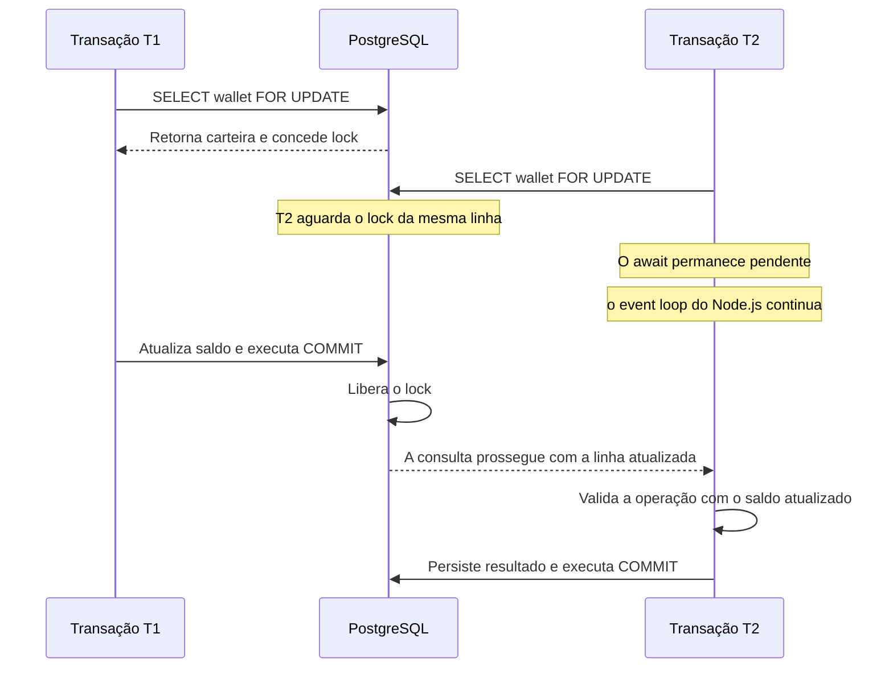
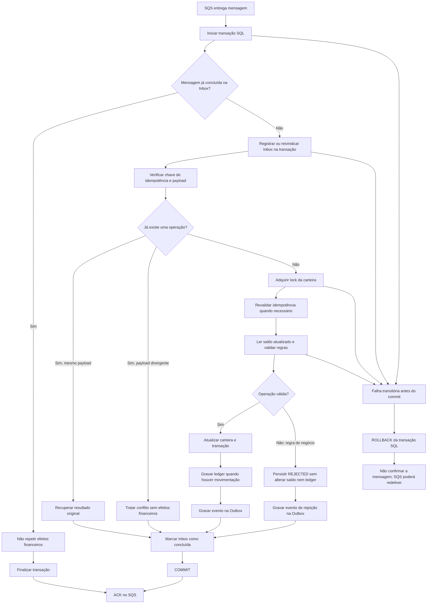

# Architecture

Este documento registra as principais decisões técnicas do desafio, seus motivos e os trade-offs considerados. As decisões poderão ser revisadas conforme a implementação e os requisitos forem evoluindo.

## 1. Estratégia de versionamento e fluxo de desenvolvimento

Neste desafio técnico, os commits são realizados diretamente na branch `main` para simplificar o fluxo de trabalho individual e manter um histórico incremental das etapas de implementação.

Em um ambiente de produção, adotaria um fluxo baseado em branches de funcionalidade e Pull Requests, com a branch `main` protegida contra alterações diretas.

O processo incluiria:

- **Branches de funcionalidade:** cada tarefa ou conjunto coeso de alterações seria desenvolvido isoladamente.
- **Pull Requests:** as alterações seriam submetidas à revisão antes de serem incorporadas à branch principal.
- **Verificações automatizadas:** testes, validações estáticas e outras etapas de CI seriam executados antes da aprovação.
- **Proteção da branch principal:** regras de aprovação, verificações obrigatórias e restrições a pushes diretos e *force pushes*, conforme a política da equipe.

Essa diferença reflete uma adaptação ao contexto do desafio técnico. Em um ambiente colaborativo, o fluxo de integração deve favorecer a revisão de código, a qualidade contínua e a segurança da branch principal.

## 2. Biblioteca para aritmética monetária: `decimal.js`

Foi escolhido o `decimal.js` considerando a maturidade do projeto, os sinais de adoção e participação comunitária no GitHub e a integração com TypeScript.

Tanto `decimal.js` quanto `big.js` são bibliotecas maduras e atendem às necessidades de aritmética decimal deste desafio. O `decimal.js` apresenta maior engajamento visível no GitHub e inclui suas próprias declarações de tipos TypeScript, enquanto o `big.js` utiliza um pacote externo para essa integração.

Em um projeto NestJS com TypeScript strict, manter a implementação e seus contratos de tipos distribuídos pelo mesmo pacote reduz uma dependência externa e simplifica a configuração do projeto.

A escolha não implica que `decimal.js` seja matematicamente superior a `big.js` para as operações atuais. Ambas são opções adequadas; a decisão prioriza a integração com TypeScript e os indicadores de adoção considerados.

## 3. Política de retry da Outbox

A publicação de mensagens da Outbox utiliza **exponential backoff**, aumentando progressivamente o intervalo entre tentativas para evitar chamadas excessivas quando o serviço de mensageria estiver temporariamente indisponível.

A política inicial adotada é:

- **Intervalo inicial:** 1 segundo.
- **Fator de crescimento:** 2 — o intervalo dobra a cada tentativa.
- **Intervalo máximo:** 5 minutos.
- **Agendamento:** cada chamada a `scheduleRetry(now)` incrementa o contador `attempts` e atualiza `nextAttemptAt`, usando o horário recebido pelo método.

| Tentativas registradas | Espera até a próxima tentativa |
| ---: | ---: |
| 1 | 1 segundo |
| 2 | 2 segundos |
| 3 | 4 segundos |
| 4 | 8 segundos |
| 5 | 16 segundos |
| Posteriores | Crescimento exponencial, limitado a 5 minutos |

O objetivo é reduzir a pressão sobre o serviço durante falhas temporárias, permitindo que a publicação seja retomada sem intervenção manual imediata.

O estado da mensagem, incluindo o contador de tentativas e o próximo horário de publicação, deverá ser persistido para que o processamento possa continuar após reinicializações da aplicação.

**Limitações atuais:** a política define um intervalo máximo, mas ainda não estabelece um limite para a quantidade total de tentativas. Também não utiliza *jitter* (variação aleatória dos intervalos). Essas decisões poderão ser revisadas conforme os requisitos operacionais forem definidos.

O README exige backoff exponencial, mas não determina os intervalos utilizados. Os valores acima são decisões adotadas nesta implementação.

## 4. Concorrência, consistência financeira e processamento

A correção financeira depende de mecanismos complementares. O lock por carteira coordena operações concorrentes; a idempotência evita aplicar a mesma operação de negócio mais de uma vez; a Inbox protege contra redelivery de mensagens; o ledger mantém o histórico das movimentações; e a Outbox permite publicar eventos após o commit. Nenhum desses mecanismos, isoladamente, substitui os demais.

### 4.1 Lock pessimista por carteira

A estratégia escolhida para concorrência sobre o saldo é o lock pessimista de escrita, usando `LockMode.PESSIMISTIC_WRITE` do MikroORM. No PostgreSQL, ele corresponde normalmente a `SELECT ... FOR UPDATE`, que adquire um bloqueio sobre a linha da carteira selecionada.

A unidade principal de concorrência é a `walletId`: operações que precisam modificar a mesma carteira são serializadas pelo banco, enquanto carteiras diferentes podem ser processadas em paralelo, desde que não exista outro recurso compartilhado em conflito.

O lock precisa ser adquirido dentro de uma transação SQL e permanece ativo até o `COMMIT` ou `ROLLBACK`. Por isso, `findByIdForUpdate()` não deve ser usado fora da unidade de trabalho transacional. Uma consulta bloqueada fica aguardando no PostgreSQL; o Node.js não precisa executar polling nem bloquear o event loop, embora a consulta mantenha sua conexão ocupada e a transação possa reter recursos durante a espera.

No nível de isolamento padrão `READ COMMITTED` do PostgreSQL, se uma transação aguarda uma linha bloqueada e a transação anterior confirma a alteração, a consulta bloqueada pode prosseguir observando a versão atualizada da linha. Se houver timeout, deadlock ou outra falha técnica, a aplicação deve tratar o erro e encerrar corretamente a transação, normalmente com rollback.

O lock do banco não é uma fila de mensagens: o PostgreSQL organiza a espera pelo bloqueio da linha, mas não reenfileira uma operação no SQS. A aplicação continua responsável por distinguir uma rejeição de negócio de uma falha técnica e decidir se deve confirmar ou permitir nova entrega da mensagem.

### 4.2 Cenário de concorrência: duas apostas de R$ 80,00

Considere uma carteira com saldo inicial de `100.00 BRL` e duas apostas distintas de `80.00 BRL` recebidas simultaneamente.

1. T1 adquire o lock da carteira e lê o saldo de `100.00 BRL`.
2. T2 tenta adquirir um lock conflitante para a mesma carteira e aguarda no PostgreSQL.
3. T1 valida a aposta, altera o saldo para `20.00 BRL` e confirma o commit, persistindo a transação processada e o lançamento de débito correspondente.
4. O lock é liberado. T2 prossegue e observa o saldo atualizado.
5. Como `20.00 BRL` não cobre uma aposta de `80.00 BRL`, T2 é rejeitada por saldo insuficiente. A rejeição é persistida, sem alteração do saldo ou novo lançamento no ledger.

Resultado esperado: uma transação `PROCESSED`, uma `REJECTED`, saldo final de `20.00 BRL` e somente um lançamento de débito no ledger. A segunda operação não provoca rollback técnico: a rejeição é um resultado de negócio válido e deve ser persistida.

### 4.3 Separação entre transação de negócio e lançamento financeiro

`WagerTransaction` e `WalletLedgerEntry` representam conceitos diferentes e complementares.

- **`WagerTransaction`** registra a operação recebida e seu resultado de negócio: identificadores do provedor, chave de idempotência, payload, tipo, referência, status, código de falha e, quando processada, o saldo resultante original.
- **`WalletLedgerEntry`** registra uma movimentação financeira efetiva: direção (`DEBIT` ou `CREDIT`), valor, moeda, saldo anterior e saldo posterior. Os lançamentos são históricos e não devem ser atualizados ou excluídos pela aplicação.

Nem toda transação de negócio produz um lançamento financeiro:

| Operação ou resultado | Registro em `WagerTransaction` | Lançamento no ledger |
| --- | --- | --- |
| `OPENING` com saldo inicial positivo | Sim | Crédito inicial |
| `BET` processada | Sim | Débito |
| `WIN` processada | Sim | Crédito |
| `LOSS` processada | Sim | Nenhum, pois não altera o saldo |
| Operação `REJECTED` | Sim | Nenhum |
| `REFUND` ou `ROLLBACK` pendente de referência | Sim, com `PENDING_REFERENCE` | Nenhum até que a operação seja resolvida e processada |

A restrição única `(wallet_id, transaction_id)` impede mais de um lançamento para a mesma transação na mesma carteira. Isso protege contra duplicação de lançamentos, mas a aplicação ainda precisa garantir que uma operação processada que altera o saldo seja persistida junto com seu lançamento na mesma transação SQL.

A chave de idempotência da transação de negócio e a identidade da mensagem da Inbox também são distintas: a primeira deduplica a operação de negócio, enquanto a segunda deduplica a mensagem de transporte recebida pelo consumidor.

### 4.4 Consistência entre saldo materializado e ledger

`wallets.balance` é o saldo atual materializado da carteira. O ledger é o histórico auditável das movimentações que justificam esse saldo. Para reconstruir o saldo, somam-se os créditos e subtraem-se os débitos:

`Saldo calculado = soma dos créditos - soma dos débitos`

Cada lançamento também precisa ser internamente consistente: o saldo posterior deve ser igual ao saldo anterior mais o valor de um crédito, ou menos o valor de um débito. As constraints do banco verificam a aritmética do lançamento, a não negatividade dos valores e a consistência entre as moedas.

Essas constraints locais não garantem, por si sós, que `wallets.balance` seja igual à soma de todos os lançamentos. Essa garantia depende da execução correta do fluxo financeiro e da atomicidade das gravações.

Dentro da mesma transação SQL, a aplicação precisa confirmar conjuntamente:

- a alteração do saldo da carteira, quando houver movimentação;
- a transação de negócio e seu resultado;
- o lançamento correspondente no ledger, quando aplicável;
- o registro da Inbox, quando a entrada vier do SQS;
- o evento correspondente na Outbox.

Se uma falha técnica impedir o commit, todas essas alterações ainda não confirmadas devem sofrer rollback. Uma rejeição de negócio, por sua vez, é persistida como resultado terminal e não deve alterar o saldo nem gerar lançamento no ledger.

Quando a carteira é criada com saldo inicial maior que zero, o fluxo deve criar a transação interna `OPENING` e seu lançamento de crédito na mesma transação SQL. Isso permite que o saldo possa ser reconstruído integralmente pelo ledger desde a abertura.

A reconciliação compara o saldo materializado com o saldo calculado pelo ledger e sinaliza divergências para investigação. Uma diferença não deve ser corrigida silenciosamente: precisa ser registrada e contabilizada para diagnóstico operacional.

O campo `resultingBalance` de `WagerTransaction` tem outra finalidade: preservar o saldo observado quando aquela operação foi processada. Em um replay idempotente, retornamos esse resultado original, não o saldo atual da carteira, que pode ter mudado por operações posteriores.

### 4.5 Fluxo de processamento de uma mensagem SQS

A fila, a Inbox, o lock, a idempotência e a Outbox têm responsabilidades distintas:

- **SQS:** entrega mensagens e permite redelivery conforme a confirmação, o período de visibilidade e a política de retry configurada.
- **Inbox:** registra a identidade da mensagem por `(consumerName, messageId)` para reconhecer redeliveries e impedir a repetição de efeitos já confirmados.
- **PostgreSQL:** coordena bloqueios de linha e fornece transações atômicas para as alterações confirmadas.
- **Chave de idempotência:** identifica a operação de negócio, inclusive se ela chegar em mensagens de transporte diferentes.
- **Outbox:** persiste eventos que devem ser publicados depois do commit, possibilitando retomar a publicação após uma falha do processo.
- **Aplicação:** coordena o fluxo, trata conflitos e decide quando confirmar a mensagem ou permitir nova entrega.

O diagrama representa o fluxo pretendido. Uma consulta prévia à Inbox ou à chave de idempotência não elimina corridas: duas instâncias podem consultar ao mesmo tempo antes que qualquer uma persista o registro. As chaves únicas no banco e o tratamento dos conflitos precisam fazer parte da implementação. Se a mesma chave de idempotência chegar com payload diferente, isso é conflito, não replay.

O `ACK` só deve ocorrer depois do commit. Se o commit acontecer, mas o processo cair antes do ACK, a redelivery deve reconhecer o registro persistido na Inbox e não repetir os efeitos financeiros. Os eventos da Outbox são publicados por um worker separado após o commit; uma falha de publicação não deve desfazer a transação financeira já confirmada.

### 4.6 Rejeição de negócio versus falha técnica

É essencial distinguir um resultado de negócio válido de uma falha que impediu concluir a transação:

| Situação | Tratamento | Mensagem SQS |
| --- | --- | --- |
| Saldo insuficiente | Persistir `REJECTED`, sem alteração de saldo ou lançamento; persistir o evento correspondente na Outbox. | ACK depois do commit. |
| Referência ausente | Persistir `PENDING_REFERENCE` e agendar novas tentativas com backoff; o worker de referências fará o reprocessamento. | ACK depois do commit, pois a pendência foi persistida de forma durável. |
| Falha transitória antes de confirmar a transação | Fazer rollback das alterações não confirmadas. | Não enviar ACK; o SQS poderá redeliver a mensagem. |
| Commit realizado, mas o processo cai antes do ACK | O resultado financeiro e a Inbox já estão persistidos. | Uma redelivery deve reconhecer a mensagem concluída e não repetir os efeitos. |
| Falha de publicação de um evento na Outbox | Manter o resultado financeiro confirmado e agendar nova tentativa de publicação. | Não reprocessar a operação financeira só por causa da falha na publicação. |

Uma rejeição por regra de negócio é um resultado terminal válido. Fazer rollback dessa rejeição apagaria o registro que precisamos preservar para auditoria e idempotência. Uma falha técnica antes do commit, por sua vez, exige rollback para impedir que apenas parte das alterações seja confirmada.

#### Política de retentativa de referências ausentes

Transações `REFUND` e `ROLLBACK` sem referência disponível são persistidas como `PENDING_REFERENCE`, com contador de tentativas e próxima execução gravados no PostgreSQL.

O worker consulta periodicamente as operações cujo horário de retentativa foi atingido e reutiliza o caso de uso financeiro existente. Dessa forma, o reprocessamento preserva as regras de negócio, a idempotência e o lock por carteira, sem duplicar a implementação do processamento financeiro.

A política permite até 10 retentativas agendadas, utilizando backoff exponencial iniciado em 1 segundo, com crescimento por fator 2 e intervalo máximo de 5 minutos. Se a referência continuar ausente após o limite estabelecido, a transação é rejeitada com `REFERENCE_NOT_FOUND`, e o evento de rejeição é persistido na Outbox.

A quantidade de tentativas e o próximo horário são persistidos no banco, permitindo que o processamento seja retomado após reinicializações da aplicação. O worker não deve depender de estado mantido exclusivamente em memória.

### 4.7 Idempotência e recuperação de concorrência

O lock, a Inbox e a chave de idempotência protegem invariantes diferentes:

- **Lock da carteira:** serializa operações concorrentes que disputam o saldo da mesma carteira.
- **Chave de idempotência:** identifica o mesmo pedido de negócio, mesmo se ele for entregue mais de uma vez ou chegar com IDs de mensagem diferentes.
- **Inbox:** deduplica a mesma mensagem de transporte por consumidor.
- **Constraints únicas:** fornecem a última linha de defesa quando duas transações concorrentes tentam inserir a mesma identidade.
- **Resultado original:** `resultingBalance` permite responder a um replay com o saldo observado no processamento original, em vez do saldo corrente da carteira.

O índice único parcial sobre `(reference_transaction_id, kind)` para operações `REFUND` e `ROLLBACK` protege contra duas reversões registradas do mesmo tipo para a mesma referência. As demais validações de domínio — por exemplo, se a referência pertence ao mesmo provedor, jogador, carteira, moeda e rodada — também precisam ocorrer na aplicação.

### 4.8 Latência e limites de espera

Operações sobre a mesma carteira podem apresentar latência adicional porque aguardam o lock. Essa espera é intencional para preservar a consistência financeira, mas deve ser observada operacionalmente.

Devemos considerar:

- configurar um `lock_timeout` adequado para evitar esperas excessivamente longas;
- tratar timeout e deadlock como falhas da transação e realizar rollback antes de tentar novamente;
- evitar manter a transação aberta durante chamadas de rede ou publicação no SQS;
- dimensionar o pool de conexões considerando contenção em carteiras muito disputadas;
- configurar a visibilidade e a política de retry do SQS de acordo com a duração esperada do processamento, considerando que redeliveries podem acontecer enquanto uma tentativa anterior ainda está ativa.

O `PESSIMISTIC_WRITE` é a estratégia principal de concorrência deste projeto. O campo `version` representa a versão de negócio da carteira e só deve ser tratado como optimistic locking do MikroORM se for configurado explicitamente para essa finalidade.

### 4.9 Garantias a validar na implementação

Esta seção registra o desenho arquitetural pretendido; não substitui a validação do código e dos testes. Ao concluir a implementação, precisamos comprovar que:

- todos os repositórios de uma operação compartilham o mesmo `EntityManager` transacional;
- o lock da carteira é adquirido dentro da transação e permanece até o commit ou rollback;
- saldo, transação, ledger e Outbox — e a Inbox quando a entrada for SQS — são confirmados atomicamente;
- operações repetidas não duplicam débitos ou créditos, inclusive quando chegam em mensagens distintas;
- rejeições de negócio são persistidas sem efeito financeiro, enquanto falhas técnicas antes do commit provocam rollback;
- a publicação da Outbox pode ser retomada após falhas sem perder o evento confirmado;
- a reconciliação compara o saldo materializado com o saldo reconstruído pelo ledger e sinaliza divergências;
- concorrência real, redelivery, recuperação após reinicialização e execução com múltiplas instâncias são validadas por testes de integração.

## 5. Estilo arquitetural e regras de dependência

O projeto adota uma abordagem baseada em **Clean Architecture** e **Ports and Adapters (Arquitetura Hexagonal)**, com um modelo de domínio inspirado em **Domain-Driven Design (DDD)** e organização em **Modular Monolith**.

A aplicação permanece como um único sistema implantável, organizado por módulos e responsabilidades. A separação de camadas busca manter as regras de negócio independentes dos detalhes de transporte, persistência e infraestrutura.

### 5.1 Camadas e responsabilidades

- **Domain:** contém entidades, value objects, invariantes e comportamentos essenciais do negócio. Exemplos incluem `Wallet`, `WagerTransaction`, `WalletLedgerEntry` e `Money`.
- **Application:** contém os casos de uso que coordenam as operações de negócio, como `CreateWalletUseCase` e `ProcessWagerTransactionUseCase`. Essa camada organiza as etapas da operação e utiliza contratos para acessar recursos externos.
- **Infrastructure:** implementa os adaptadores de entrada e saída, incluindo controllers HTTP, repositórios, persistência PostgreSQL e integrações com mensageria.

Controllers são responsáveis pelo contrato HTTP: recebem requisições, validam a estrutura dos dados, invocam casos de uso e convertem resultados em respostas HTTP. Não devem concentrar regras financeiras ou coordenar diretamente a persistência.

Os casos de uso coordenam o fluxo da aplicação, mas não substituem o domínio. Invariantes como impedir saldo negativo, garantir compatibilidade monetária e determinar a direção de uma reversão pertencem aos conceitos de domínio responsáveis por essas regras.

### 5.2 Ports and Adapters

A camada de aplicação depende de contratos, ou *ports*, em vez de depender diretamente das implementações de infraestrutura.

Por exemplo, `UnitOfWorkPort` define a fronteira transacional utilizada pelos casos de uso. A implementação concreta utiliza o MikroORM e o PostgreSQL para executar a operação em uma transação compartilhada.

Essa abordagem permite substituir ou adaptar tecnologias de infraestrutura sem exigir que as regras centrais de negócio conheçam seus detalhes de implementação.

### 5.3 Direção das dependências

O fluxo de uma operação HTTP segue, conceitualmente, esta direção:

`HTTP Controller → Application Use Case → Domain + Ports → Infrastructure Adapters`

O adaptador HTTP não executa diretamente as regras financeiras. O caso de uso coordena a operação e utiliza o domínio para validar e realizar mudanças de estado, enquanto os ports fornecem os recursos necessários à persistência e às transações.

Uma futura entrada por SQS deverá reutilizar o mesmo caso de uso, sem duplicar as regras do processamento financeiro. O adaptador de mensageria terá responsabilidades próprias de recebimento, deduplicação, confirmação e recuperação de mensagens.

### 5.4 Objetivo e trade-offs

A separação aumenta a quantidade de arquivos e introduz contratos explícitos entre componentes. Em contrapartida, torna mais claras as responsabilidades, reduz o acoplamento com frameworks e facilita a evolução e validação isolada das regras de negócio.

A arquitetura é pragmática: utiliza os princípios de Clean Architecture, Ports and Adapters e DDD quando contribuem para a correção financeira, a consistência transacional e a testabilidade, evitando a criação de abstrações sem uma responsabilidade concreta.
